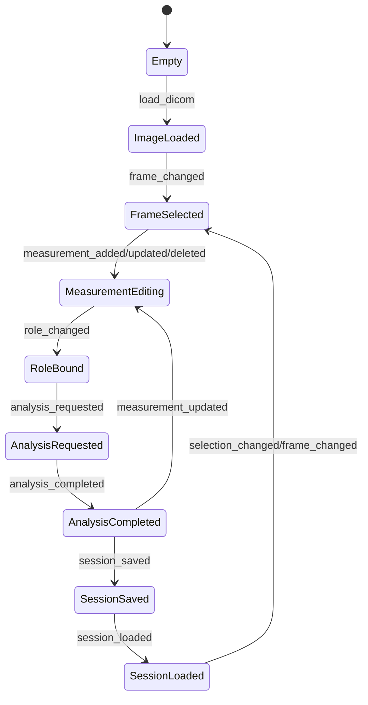

# 모두바 2-창 전환 설계안 (Store/Event 우선)

## 0) 목적 및 범위
- 본 문서는 `DicomViewer` 단일 클래스 결합 구조를 **공용 Domain Store + 이벤트 계약 기반**으로 재편하기 위한 기준안이다.
- 우선순위는 물리 UI 분리보다 **상태 소유권/이벤트 계약 확정**이며, 기존 기능 삭제 없이 회귀 안정성을 최우선으로 한다.

---

## 1) 상태 다이어그램

### Store 내부 상태 구성
- `ImageContext`: 이미지/프레임/role binding 컨텍스트
- `Measurement`: ROI/Line/Polygon/Grid ROI 등 입력 엔터티
- `AnalysisRun`: 분석 실행 단위(요청~완료)
- `ResultHistoryEntry`: 결과 이력 단위
- `ImageAnalysisGroup`: 이미지 단위 그룹
- `StudySession`: 세션 단위 묶음

---

## 2) 이벤트 계약서

### 공통 규칙
- 이벤트 payload에는 객체 참조를 넣지 않고, `id/type/change` 중심의 메타데이터만 사용.
- 실데이터 접근은 전부 `DomainStore selector`로 조회.

### 필수 이벤트 스키마 (v1)

| Event | 발행 주체 | 필수 필드 | 설명 |
|---|---|---|---|
| `measurement_added` | 창 A | `measurement_id`, `image_id`, `kind`, `change=created` | 측정 생성 |
| `measurement_updated` | 창 A | `measurement_id`, `image_id`, `kind`, `change=updated` | 측정 수정 |
| `measurement_deleted` | 창 A | `measurement_id`, `image_id`, `kind`, `change=deleted` | 측정 삭제 |
| `selection_changed` | 창 A | `image_id`, `selected_measurement_ids`, `change=selection` | 선택 대상 변경 |
| `frame_changed` | 창 A | `image_id`, `frame_index`, `change=frame` | 프레임 이동 |
| `role_changed` | 창 A | `measurement_id`, `image_id`, `role`, `change=role` | ROI role 지정/변경 |
| `analysis_requested` | 창 B | `run_id`, `image_id`, `analysis_type`, `input_measurement_ids` | 분석 요청 |
| `analysis_completed` | 창 B | `run_id`, `image_id`, `analysis_type`, `result_entry_ids` | 분석 완료 |
| `session_saved` | 공용 | `session_id`, `snapshot_timestamp`, `change=saved` | 세션 저장 |
| `session_loaded` | 공용 | `session_id`, `snapshot_timestamp`, `change=loaded` | 세션 로드 |

---

## 3) 기능 이전 매트릭스 (현재 함수 → A/B/공용)

> 기준 파일: `dicom_viewer.py`

| 현재 함수(예시) | 대상 | 이유 |
|---|---|---|
| `_load_dicom_file`, `load_dicom_folder`, `show_image` 계열 | 창 A | 영상 로딩/뷰어 책임 |
| `_build_measure_toolbar`, `_set_measurement_mode`, `start_measurement`, `finish_measurement` 계열 | 창 A | 측정 생성/편집 입력 |
| `_iter_visible_roi_measurements`, `_get_measurement_roi_role`, `_normalize_roi_role` | 창 A | role 입력/편집 |
| `_refresh_analysis_selectors`, `_auto_bind_analysis_inputs_from_roles` | 공용(selector) + 창 B 호출 | 입력 후보 계산은 selector 책임 |
| `calculate_snr`, `calculate_cnr`, `calculate_uniformity`, `run_mtf_analysis` 계열 | 창 B | 분석 실행 책임 |
| `_append_history_entry`, `_refresh_result_history_table`, `build_history_comparison` | 창 B + 공용 history store | 결과/히스토리 표현은 B, 저장은 공용 |
| `export_result_history_csv`, `copy_result_history_to_clipboard`, report/export 계열 | 창 B | 결과 소비 기능 |
| `_serialize_history_entry`, `_deserialize_history_entry`, save/load preset/session 계열 | 공용 | 직렬화/복원 단일 진입점 |
| `StudySession`, `ImageAnalysisGroup`, `ResultHistoryStore` 관리 코드 | 공용 | 단일 SoT |

---

## 4) 단계별 리팩토링 계획 (순서 고정)

### Phase 1 (UI 유지): Domain Store + Event Dispatcher 도입
1. `domain_store.py` 추가
   - 엔터티 6종 및 `DomainState` 도입
   - `EventDispatcher` + 필수 이벤트 발행
   - selector API 제공
2. 기존 `DicomViewer`는 기존 상태를 유지하되, 신규 store에 동시 기록(dual-write) 시작
3. 세션 저장 시 `store.snapshot(timestamp)` 기반 원자 스냅샷 생성

### Phase 2: 직접 상태 접근 → selector 기반 조회 전환
1. 분석 입력 계산 로직을 `store.select_analysis_inputs()`로 치환
2. role/frame/selection 변경 후 B 패널은 이벤트 기반 invalidate만 수행
3. B 패널 렌더 함수는 selector 결과만 소비

### Phase 3: Analysis/Results/History를 Toplevel로 분리
1. 단일 `Tk()` 유지 + `Toplevel()`로 결과 창 생성
2. 창 A/B 직접 참조 제거, 이벤트 구독으로 동기화
3. 패널 단위 targeted refresh 적용(analysis panel/result panel/history table)

### Phase 4: Session/Export/Report의 결과 창 중심 재배치
1. 세션 저장/로드 버튼과 export/report를 창 B 중심 이동
2. 저장/복원은 store 단일 진입점만 허용
3. 두 창 스냅샷 timestamp 동기 일치 검증

---

## 5) 회귀 리스크 분석 및 대응 전략

| 리스크 | 영향 | 대응 |
|---|---|---|
| dual-write 불일치 | A/B 표시 불일치 | Phase 1에서 selector 기반 golden assertion 도입 |
| 이벤트 누락 | 패널 stale 상태 | 필수 이벤트 contract test 추가 |
| payload 과대(객체 참조) | 메모리/결합 증가 | 메타데이터-only 규칙 테스트로 차단 |
| 전체 redraw 회귀 | 성능 저하/flicker | invalidate → targeted refresh 규약 강제 |
| 세션 비원자 저장 | 복원 불일치 | 단일 timestamp snapshot 강제 |
| Toplevel 분리 시 root 중복 생성 | 이벤트 루프 충돌 | `Tk()` 단일 인스턴스 lint/test |

---

## 6) 이후 코드 패치 제안

### 이번 패치(Phase 1 착수)
- `domain_store.py` 추가
  - 엔터티/상태/이벤트/selector 구현
  - 필수 이벤트 10종 발행 API 제공
  - 세션 원자 스냅샷/복원 API 제공
- `tests/test_domain_store_phase1.py` 추가
  - ROI 변경 → selector 즉시 반영
  - frame 변경 → 분석 대상 갱신
  - role 변경 → 입력 후보 재구성
  - session 저장/복원 일치
  - 이벤트 계약(메타데이터-only) 검증

### 다음 패치 권장(Phase 2 시작)
1. `DicomViewer` 분석 입력 계산부에 `store.select_analysis_inputs()` 주입
2. 기존 `_refresh_analysis_selectors()` 내부에서 직접 상태 순회 제거
3. `analysis_requested`/`analysis_completed`를 B 패널 액션 경계로 고정

